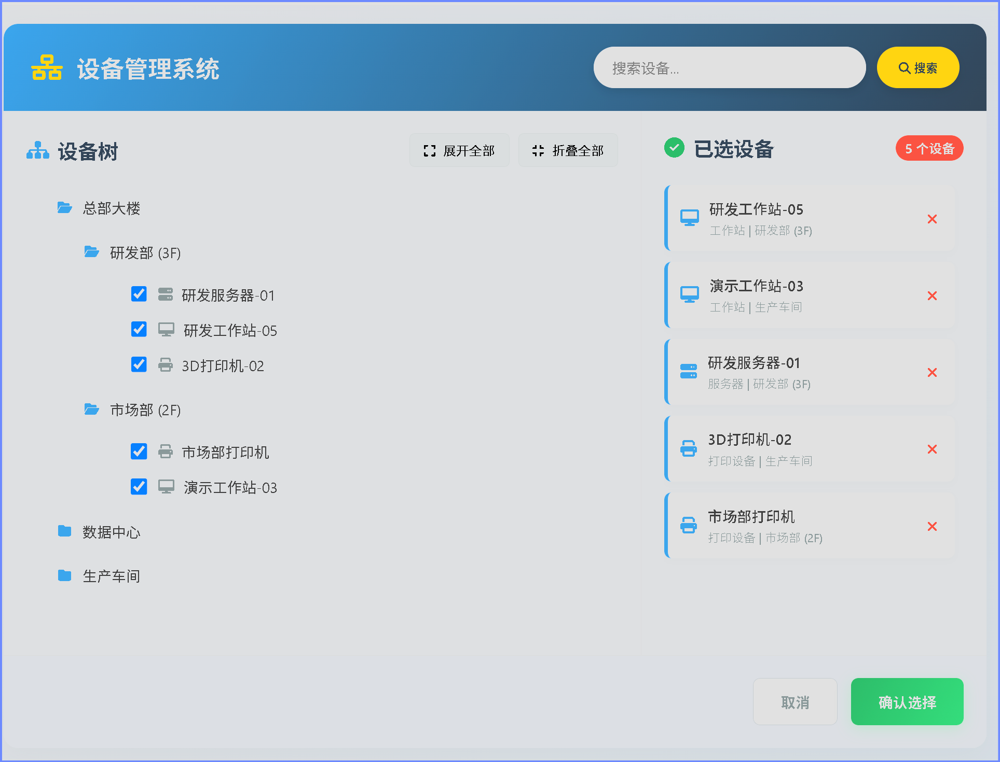

## 功能特性
- **设备树展示**：以树形结构展示不同区域、部门的设备，支持展开和折叠节点。
- **搜索功能**：支持根据设备名称搜索设备，搜索结果会高亮显示匹配内容。
- **多选功能**：用户可以在设备树中选择多个设备，已选设备会显示在右侧列表中。
- **操作功能**：提供重置选择、确认选择等操作按钮。

## 技术栈
- **Vue2**：用于构建用户界面和实现交互逻辑。
- **Font Awesome**：提供图标支持。
- **CDN**：通过 CDN 引入 Vue2 和 Font Awesome，无需本地安装依赖。

## 运行方式
1. 下载 `device.html` 文件到本地。
2. 使用浏览器直接打开 `device.html` 文件即可运行系统。

## 界面截图

## 代码说明
### HTML 部分
- 定义了系统的整体结构，包括头部搜索栏、设备树区域、已选设备区域和操作按钮区域。
- 引入了 Vue2 和 Font Awesome 的 CDN 链接。
- 定义了系统的样式，包括布局、颜色、动画等。

### JavaScript 部分
- 使用 Vue2 创建了一个实例，管理系统的状态和逻辑。
- 定义了设备树数据、搜索查询、已选设备等数据。
- 实现了设备树的展开和折叠、搜索、多选、移除设备等方法。

## 自定义扩展
- **设备类型**：可以在 `getDeviceIcon` 和 `getDeviceType` 方法中添加新的设备类型和对应的图标、名称。
- **数据结构**：可以修改 `deviceTree` 数据，添加或修改设备、部门和区域信息。